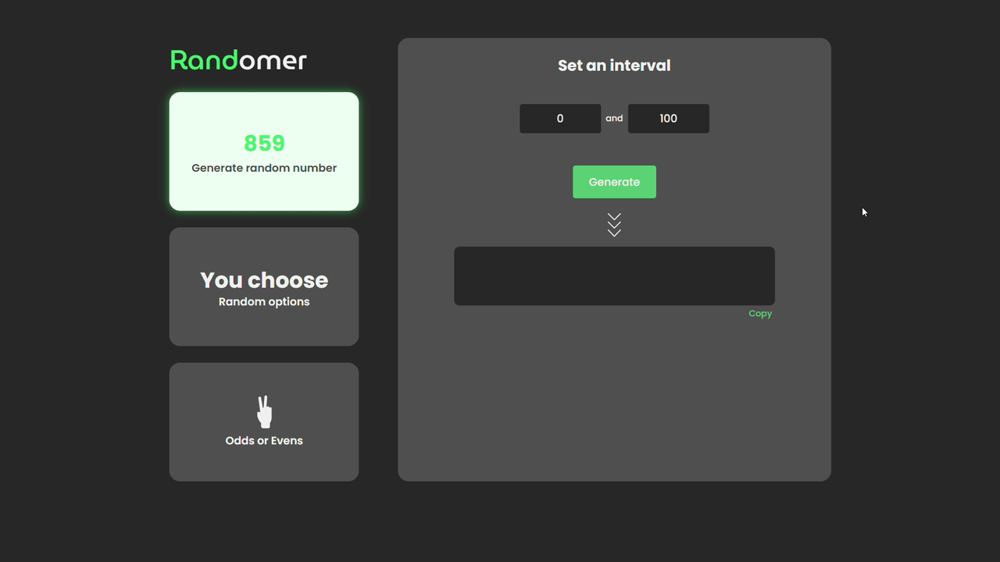
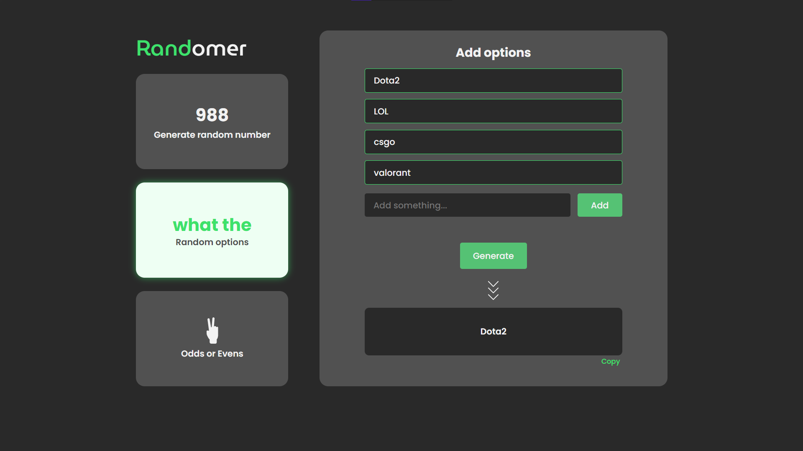

<h6>Um app web para randominar escolhas, simple e com intuituito de estudar</h6>

# Techs
* [React](https://reactjs.org/)
* [NextJS](https://nextjs.org/)

  <h2><a href="https://randomer.vercel.app/" target="_blank" rel="noopener noreferrer">RandomerApp</a></h2>

 
 

 

